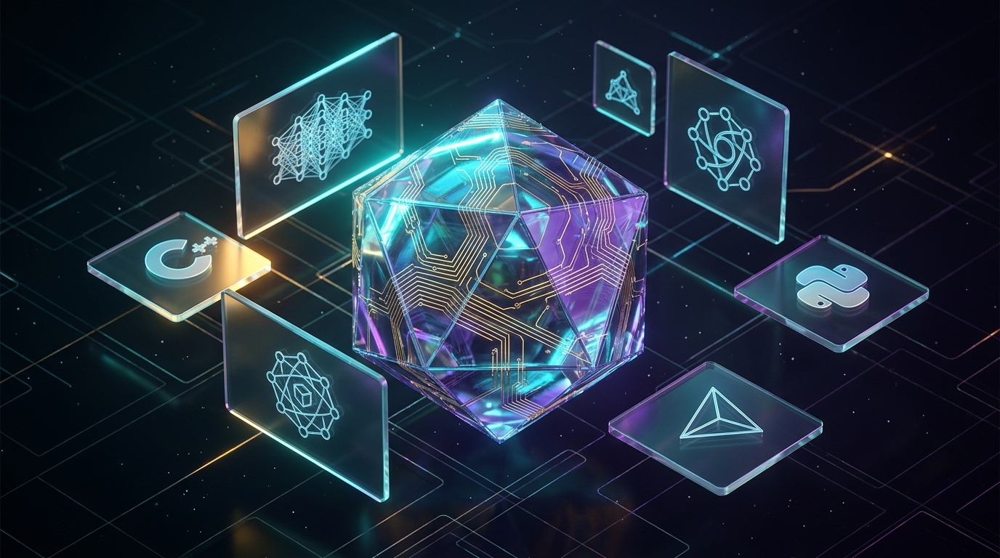

<p align="center">
  
</p>

<p align="center">
  <a href="https://daohuutrong2404.github.io" target="_blank">
    
  </a>
</p>

<h1 align="center">⚡ Hi there, I'm Đào Hữu Trọng (DTrongVIP) 👋</h1>

<p align="center">
  <a href="https://github.com/DaoHuuTrong2404">
    
  </a>
</p>

<p align="center">
  
  <a href="https://github.com/DaoHuuTrong2404"></a>
  
  
  
  
</p>

<br />

<div align="center">
  <table width="100%">
    <tr>
      <td align="center" style="background: #0A0E1A; border: 1.5px solid #00F0FF; border-radius: 12px; padding: 22px;">
        <h3 align="center" style="margin-top: 5px; color: #00F0FF;">🎮 KHÔNG GIAN 3D TƯƠNG TÁC THỜI GIAN THỰC (THREE.JS & WEBGL)</h3>
        <p align="center" style="color: #E2E8F0;"><i>Dùng chuột kéo xoay 360°, cuộn bánh xe để zoom in/out và tương tác các khối lập phương AI phát sáng tại:</i></p>
        <p align="center">
          <a href="https://daohuutrong2404.github.io" target="_blank">
            
          </a>
          <a href="https://daohuutrong2404.github.io" target="_blank">
            
          </a>
        </p>
      </td>
    </tr>
  </table>
</div>

---

### 👨‍💻 About Me & Academic Horizon

```yaml
Name: Đào Hữu Trọng (Dao Huu Trong)
Brand: DTrongVIP
Education: Freshman @ Can Tho University (College of Information & Communication Technology)
Major: Artificial Intelligence (Trí Tuệ Nhân Tạo) - Cohort 52 (2026 - 2031)
Philosophy: "Empowering human potential through autonomous intelligence & resilient software engineering."
Core Focus:
  - Autonomous Agent Architectures (GNAP Multi-Agent Swarm, ReAct Reasoning Engine)
  - Computer-Use Agents (CUA 2.0) & Visual Structured Object Model (SOM)
  - Creative 3D Web Systems (Three.js, WebGL, GSAP 3 Kinetic Motion)
  - Competitive Algorithms & Clean Memory Management in Modern C++17/20
  - High-Efficiency Cloud Execution on GitHub Codespaces (4 Cores, 16GB RAM)
```

---

### 🛠️ Tech Stack & Technical Arsenal

<table align="center" width="100%">
  <tr>
    <td width="22%" valign="top"><b>💻 Languages</b></td>
    <td>
      
      
      
      
      
      
      
      
    </td>
  </tr>
  <tr>
    <td width="22%" valign="top"><b>🧠 AI & Deep Learning</b></td>
    <td>
      
      
      
      
      
      
      
    </td>
  </tr>
  <tr>
    <td width="22%" valign="top"><b>🤖 Agents & Swarm Protocols</b></td>
    <td>
      
      
      
      
      
    </td>
  </tr>
  <tr>
    <td width="22%" valign="top"><b>✨ Creative & 3D Web</b></td>
    <td>
      
      
      
      
    </td>
  </tr>
  <tr>
    <td width="22%" valign="top"><b>☁️ Cloud & Infrastructure</b></td>
    <td>
      
      
      
      
      
    </td>
  </tr>
</table>

---

### 📊 GitHub Activity & Real-Time Stats

<p align="center">
  
  
</p>

<p align="center">
  
</p>

---

### 🐍 GitHub Contribution Snake Animation

<p align="center">
  <picture>
    <source media="(prefers-color-scheme: dark)" srcset="https://raw.githubusercontent.com/DaoHuuTrong2404/DaoHuuTrong2404/output/github-contribution-grid-snake-dark.svg">
    <source media="(prefers-color-scheme: light)" srcset="https://raw.githubusercontent.com/DaoHuuTrong2404/DaoHuuTrong2404/output/github-contribution-grid-snake.svg">
    
  </picture>
</p>

---

### 🚀 Highlighted Repositories & Systems

<div align="center">
  <table width="100%">
    <tr>
      <td width="50%" valign="top">
        <h4>🤖 <a href="https://github.com/DaoHuuTrong2404/autonomous-ai-agents-workspace">autonomous-ai-agents-workspace</a></h4>
        <p>Production-grade AI Agent architectures: ReAct reasoning loops, GNAP multi-agent swarms, Vision CUA SOM navigation, and zero-dependency Hybrid RAG at Can Tho University.</p>
      </td>
      <td width="50%" valign="top">
        <h4>🎮 <a href="https://daohuutrong2404.github.io">daohuutrong2404.github.io</a></h4>
        <p>Interactive procedural 3D graphics, PBR shader materials, dynamic orbiting cubes, audio synthesizer, and smooth 60fps GSAP kinetic motion.</p>
      </td>
    </tr>
    <tr>
      <td width="50%" valign="top">
        <h4>📐 <a href="https://github.com/DaoHuuTrong2404/cpp-data-structures-and-algorithms">cpp-data-structures-and-algorithms</a></h4>
        <p>Comprehensive algorithmic mastery, competitive programming implementations, AVL trees, Dijkstra graphs, and modern C++17 memory management.</p>
      </td>
      <td width="50%" valign="top">
        <h4>⚡ <a href="https://github.com/DaoHuuTrong2404/cuongmeai-toolkit">cuongmeai-toolkit</a> <i>(Private Core)</i></h4>
        <p>Private master agentic engineering suite: 407 skills orchestrator, Computer-Use Agent (CUA), Codespaces 16GB Cloud Hub, and Jarvis Neural Voice.</p>
      </td>
    </tr>
  </table>
</div>

---

### 🌐 Connect & Network

<p align="center">
  <a href="mailto:huutrong748@gmail.com"></a>
  <a href="https://github.com/DaoHuuTrong2404"></a>
  <a href="https://daohuutrong2404.github.io" target="_blank"></a>
  <a href="https://ctu.edu.vn" target="_blank"></a>
</p>

---

<p align="center">
  
</p>

<p align="center">
  <i>⭐️ "The best way to predict the future is to invent it." — Alan Kay ⭐️</i>
</p>
